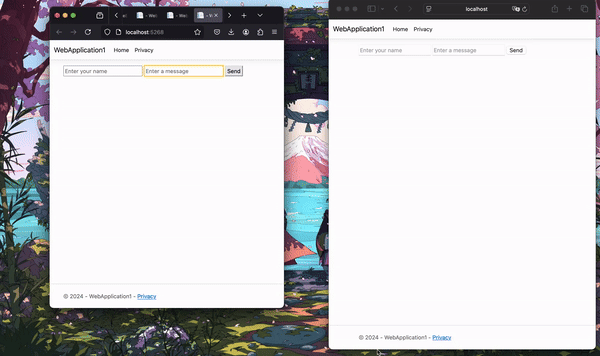

# chat-app

this very minimalistic real time chat app is a learning project to practice a bit more of c# and it's web use cases 
with signalR library that allows the connection between multiple clients (users). 

_(to be continued)_

